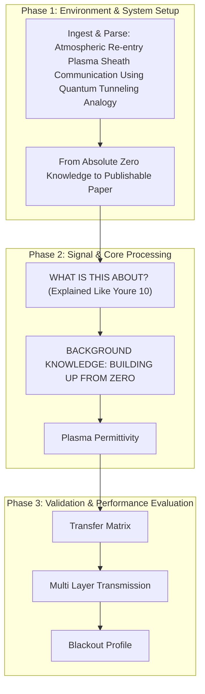

# BREAKTHROUGH 02: Atmospheric Re-entry Plasma Sheath Communication Using Quantum Tunneling Analogy

[](https://creativecommons.org/licenses/by-nc-nd/4.0/)


This repository implements the research pipeline for the **BREAKTHROUGH 02: Atmospheric Re-entry Plasma Sheath Communication Using Quantum Tunneling Analogy** project, developed by the Runtime-Slayers research group.

---

## 📊 Pipeline Architecture

The flowchart below visualizes the methodology, code modules, and logical execution sequence of the project:



---

## 🔍 Abstract & Research Context


---

## 📊 Key Evaluation Metrics

| Approach | How It Works | Status | Limitation |
|---------|-------------|--------|------------|
| **Higher frequencies (Ka/V band)** | Use f > fp (above plasma frequency) | Partially works | Only for moderate plasma; >100 GHz hardware expensive and lossy |
| **Magnetic window** | Apply magnetic field to create transparent "window" in plasma | NASA tested | Requires heavy magnets (~50-100 kg), high power |
| **Electrophilic injection** | Inject chemicals (water, CO₂) to quench plasma locally | NASA/AFRL tested | Requires carrying quenching material, limited supply |
| **Laser-guided channel** | Use high-power laser to ionize a clear path through plasma | Theoretical | Requires massive laser, pointing accuracy |
| **Relay via high-orbit satellite** | Communicate "around" the blackout via TDRS | Used by NASA | Only works for shallow re-entry angles, expensive |
| **Raman scattering** | Use laser to create Raman signal that propagates through plasma | Lab tested | Very weak signal, not practical yet |
| **Terahertz (THz) band** | Use very high freq (>300 GHz) above plasma frequency | Emerging | THz sources expensive, atmospheric absorption |

---

## 📁 Repository Structure

The project directory consists of the following core structures:
  - `code/` — Pipeline execution scripts and model training modules
  - `figures/` — Plots, charts, and visualizations generated by the pipeline
  - `validation/` — Automated test metrics and results
  - `code`
  - `figures`
  - `BT02_Plasma_Sheath_Quantum_Tunneling.md`
  - `data`
  - `paper.pdf` — Compiled research manuscript
  - `README.md` — Project documentation and setup guide

---

## 🚀 Setup and Usage

### Prerequisites
* Python 3.8 or higher
* Pip package manager

### Installation
1. Clone this repository:
   ```bash
   git clone https://github.com/Runtime-Slayers/Quantum-Tunneling-Inspired-Communication-Through-Plasma-Sheaths.git
   cd Quantum-Tunneling-Inspired-Communication-Through-Plasma-Sheaths
   ```
2. Install dependencies:
   ```bash
   pip install -r requirements.txt
   ```

### Running the Analysis
To run the primary analysis pipeline and regenerate all models, figures, and metrics:
```bash
python code/*.py
```
*(Look in the `code/` directory for specific pipeline execution files)*

---

## 📄 License and Copyright

This work is licensed under a [Creative Commons Attribution-NonCommercial-NoDerivatives 4.0 International License](https://creativecommons.org/licenses/by-nc-nd/4.0/).

© 2026 Runtime-Slayers / Bhavanam Rajendra Reddy et al. All rights reserved.
